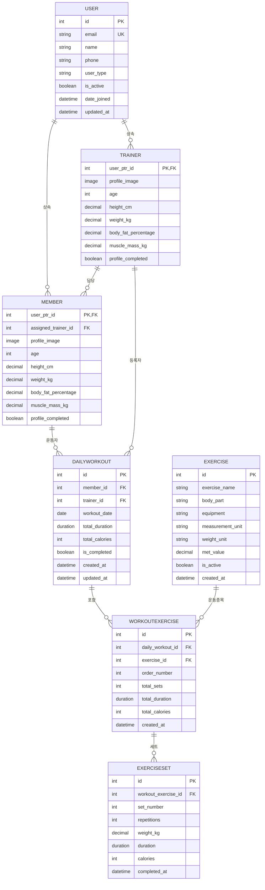

# 💪 TrainMate


<br>

- **프로젝트 명**: TrainMate (Personal Training Management Platform)
- **프로젝트 진행 기간**: 3주 (25.07.28 ~ 25.08.18)
- **프로젝트 유형**: 트레이너 전용 웹 플랫폼

<br>

## 🏋️‍♂️ 1. 팀 소개

| 이름   | 역할  | 담당 파트               |
|--------|-------|-------------------------|
| 김민수  | 팀장  | 기획/디자인              |
| 남현정  | FE    | Frontend 개발           |
| 양호진  | FE    | Frontend 개발           |
| 김가영  | BE    | Backend 개발            |

<br>

TrainMate는 유저 타입 '트레이너'를 중심으로 제공되는 개인 트레이닝 관리 서비스입니다. 
트레이너가 자신의 회원을 체계적으로 관리할 수 있고, 오프라인 수업을 진행하는 동안 발생하는 운동 기록을 실시간으로 관리할 수 있습니다. 
각 회원이 언제 어떠한 운동을 진행했는지 세트별로 상세하게 기록할 수 있으며, MET 기반 칼로리 계산을 통해 과학적인 운동 데이터를 제공합니다.

<br>

## 🎯 2. 프로젝트 개요

### 2.1 개발 배경

현재 대부분의 헬스장과 개인 트레이너들은 회원 관리와 운동 기록을 수기나 단순한 메모 앱에 의존하고 있습니다. 이로 인해 다음과 같은 문제점들이 발생합니다:

- 📝 **비체계적인 기록 관리**: 수기 작성으로 인한 데이터 분실 및 부정확성
- 👥 **회원 정보 관리의 어려움**: 여러 회원의 정보를 체계적으로 관리하기 어려움
- 📊 **운동 진행 상황 추적 부족**: 회원별 운동 성과와 발전 과정을 객관적으로 분석하기 어려움
- ⏰ **실시간 기록의 한계**: 운동 중 즉시 정확한 데이터를 기록하기 어려운 환경

### 2.2 솔루션

TrainMate는 이러한 문제들을 해결하기 위해 다음과 같은 핵심 가치를 제공합니다:

- 🏋️‍♂️ **실시간 운동 기록**: 수업 중 즉시 세트별 상세 데이터 입력 및 관리
- 👥 **체계적인 회원 관리**: 트레이너별 담당 회원 배정 및 프로필 관리
- 📈 **자동 데이터 집계**: 세트 → 운동 → 일일 총계의 계층적 자동 계산
- 🔬 **과학적 칼로리 계산**: MET 공식 기반 정확한 칼로리 소모량 산출
- 🔐 **권한 기반 접근**: 사용자 타입별 차별화된 데이터 접근 권한

### 2.3 대상 사용자

- **주 타겟**: 헬스장 운영 및 프리랜서 헬스 트레이너
- **부 타겟**: PT 수업 및 헬스장 이용자(회원)

<br>

## 3. 개발 목표 및 핵심 기술

### 3.1 기술적 목표

1. **Django Rest Framework 활용한 RESTful API 구축**
   - Class-Based Views를 통한 체계적인 API 설계
   - Serializer를 활용한 데이터 검증 및 직렬화
   - drf-spectacular를 통한 자동 API 문서화

2. **Multi-table 상속을 통한 효율적인 사용자 모델 설계**
   - User 모델을 상속받는 Trainer, Member 모델 구현
   - 역할별 차별화된 기능 및 권한 제공

3. **JWT 토큰 기반 보안 인증 시스템**
   - Access/Refresh Token을 통한 세션 관리
   - Custom Claims를 통한 사용자 타입 정보 포함

4. **계층적 운동 데이터 모델링**
   - DailyWorkout → WorkoutExercise → ExerciseSet의 3단계 구조
   - 자동 집계 시스템을 통한 데이터 일관성 보장

5. **PostgreSQL을 활용한 관계형 데이터베이스 설계**
   - 복잡한 운동 데이터 관계 설정
   - 정규화를 통한 데이터 무결성 보장

<br>

## 4. 시스템 요구사항 및 구현 기능

### 4.1 인증 및 사용자 관리 ✅

#### 4.1.1 회원가입 및 로그인
- **JWT 기반 인증 시스템**: Access/Refresh Token 방식
- **사용자 타입 구분**: Trainer / Member 역할 분리
- **비밀번호 정책**: 10자리 이상, 영문/숫자/특수문자 포함 검증
- **토큰 갱신**: Refresh Token을 통한 Access Token 자동 갱신

#### 4.1.2 프로필 관리
- **기본 정보 관리**: 이름, 연락처, 이메일 등
- **신체 정보 관리**: 나이, 키, 몸무게, 체지방률, 골격근량
- **프로필 이미지**: 이미지 업로드 및 수정 기능
- **프로필 완성도**: 정보 입력 상태 추적

### 4.2 회원 관리 기능 (트레이너 전용) ✅

#### 4.2.1 회원 정보 CRUD
- **회원 검색**: 미배정 회원 검색 및 필터링
- **회원 등록**: 검색된 회원을 담당 회원으로 배정
- **회원 목록 조회**: 담당 회원 리스트 및 상태 확인
- **회원 상세 정보**: 개별 회원의 프로필 및 운동 기록 조회

#### 4.2.2 권한 기반 접근 제어
- **트레이너**: 본인 정보 + 담당 회원 데이터 접근 가능
- **회원**: 본인 데이터만 접근 가능
- **데이터 보안**: 엄격한 권한 검증을 통한 무단 접근 방지

### 4.3 운동 기록 관리 시스템 ✅

#### 4.3.1 실시간 운동 기록
- **세트별 상세 기록**: 횟수, 중량, 소요시간, 칼로리 개별 관리
- **운동 종목 관리**: 부위별, 도구별 분류된 운동 목록
- **실시간 데이터 입력**: 운동 중 즉시 세트 추가 및 수정
- **자동 집계**: 세트 → 운동 → 일일 총계 자동 계산

#### 4.3.2 운동 데이터 구조
```
DailyWorkout (일일 운동)
├── WorkoutExercise (개별 운동)
│   ├── ExerciseSet (세트 1)
│   ├── ExerciseSet (세트 2)
│   └── ExerciseSet (세트 3)
└── 총 운동시간 / 총 칼로리 (자동 계산)
```

#### 4.3.3 과학적 칼로리 계산 ✅
- **MET 기반 계산**: `칼로리 = MET × 체중(kg) × 운동시간(시간)`
- **운동 강도별 MET 값**:
  - 저강도 근력운동: 3.5 MET
  - 중/고강도 근력운동: 6.0 MET
- **기본 소요시간**: 미입력 시 1분 30초 기준 자동 계산

### 4.4 데이터 관리 및 분석 ✅

#### 4.4.1 운동 기록 조회
- **회원별 운동 기록**: 날짜별, 운동별 그룹화된 데이터 제공
- **세트별 상세 조회**: 개별 세트 정보 및 수정/삭제 기능
- **일일 운동 요약**: 총 운동시간, 총 소모 칼로리 제공

#### 4.4.2 유연한 데이터 수정
- **실시간 수정**: 운동 기록 실시간 업데이트
- **세트 추가/삭제**: 기존 운동에 세트 추가 또는 개별 세트 삭제
- **자동 재계산**: 데이터 변경 시 관련 총계 즉시 반영

<br>

## 5. 기술 스택

### 5.1 Backend

 
 


### 5.2 API Documentation & Tools


### 5.3 배포 환경


### 5.4 Development Tools


<br>

## 6. 개발 환경 및 배포

### 6.1 개발 환경

- **Development Tools**: VSCode, Git, GitHub
- **Backend Framework**: Python, Django, Django Rest Framework
- **Database**: PostgreSQL
- **Authentication**: JWT (django-rest-framework-simplejwt)
- **API Documentation**: drf-spectacular (Swagger UI)
- **Package Management**: python-decouple, CORS headers

### 6.2 배포 환경

- **Backend**: AWS Lightsail
- **Frontend**: Vercel (React)
- **Database**: PostgreSQL
- **API 연동**: CORS 설정을 통한 프론트엔드-백엔드 통신

### 6.3 배포 URL

- **서비스 URL**: [https://trainmate-pi.vercel.app/](https://trainmate-pi.vercel.app/)
- **API 서버**: AWS Lightsail 호스팅
- **API 문서**: `/api/docs/` (Swagger UI)
- **Admin 페이지**: `/admin/`

### 6.4 배포 아키텍처
```
[Frontend - Vercel]
↓ (API 요청)
[Backend - AWS Lightsail]
↓
[PostgreSQL Database]
```

<br>

## 7. API 문서 및 엔드포인트
### 7.1 API 문서
- **Swagger UI**: `/api/docs/` - 대화형 API 테스트 환경
- **ReDoc**: `/api/redoc/` - 정적 API 문서
- **OpenAPI Schema**: `/api/schema/` - JSON/YAML 스키마

### 7.2 주요 API 엔드포인트

#### 🔑 인증 관련 (auth/)
| 엔드포인트 | 메서드 | 설명 | 인증 필요 |
|:----------|:-------|:-----|:--------:|
| `/auth/signup/` | POST | 회원가입 (Trainer/Member) | ❌ |
| `/auth/login/` | POST | 로그인 및 JWT 토큰 발급 | ❌ |
| `/auth/logout/` | POST | 로그아웃 | ✅ |
| `/auth/token/refresh/` | POST | Access Token 갱신 | ❌ |

#### 👥 회원 관리 (api/members/)
| 엔드포인트 | 메서드 | 설명 | 권한 |
|:----------|:-------|:-----|:-----|
| `/api/members/profile/` | GET, PUT, PATCH | 내 프로필 조회/수정 | 본인 |
| `/api/members/profile/<user_id>/` | GET | 다른 사용자 프로필 조회 | 인증된 사용자 |
| `/api/members/trainer-members/` | GET | 트레이너의 담당 회원 목록 | 트레이너 |
| `/api/members/register-member/` | POST | 회원을 트레이너에게 배정 | 트레이너 |
| `/api/members/search/` | GET | 회원 검색 (미배정 회원) | 트레이너 |
| `/api/members/trainer/<trainer_id>/` | GET | 트레이너 상세 정보 | 인증된 사용자 |
| `/api/members/member/<member_id>/` | GET | 회원 상세 정보 | 관련 사용자 |

#### 🏃‍♀️ 운동 관리 (api/workouts/)
| 엔드포인트 | 메서드 | 설명 | 권한 |
|:----------|:-------|:-----|:-----|
| `/api/workouts/exercises/` | GET | 운동 목록 조회 | 인증된 사용자 |
| `/api/workouts/members/<member_id>/records/` | GET | 회원 운동 기록 조회 | 관련 사용자 |
| `/api/workouts/members/<member_id>/workout-sets/` | POST | 새 운동 세트 등록 | 관련 사용자 |
| `/api/workouts/members/<member_id>/exercises/<exercise_id>/sets/` | GET | 특정 운동의 세트 목록 | 관련 사용자 |
| `/api/workouts/members/<member_id>/exercises/<exercise_id>/add-set/` | POST | 기존 운동에 세트 추가 | 관련 사용자 |
| `/api/workouts/members/<member_id>/exercises/<exercise_id>/sets/<set_id>/` | GET, PATCH, DELETE | 개별 세트 관리 | 관련 사용자 |

<br>

## 8. 데이터베이스 설계 (ERD)

### 8.1 주요 모델 관계



### 8.2 주요 설계 특징

- **Multi-table 상속**: User → Trainer/Member로 역할별 분리
- **계층적 운동 데이터**: 일일운동 → 운동종목 → 개별세트의 3단계 구조
- **자동 집계 시스템**: 하위 데이터 변경 시 상위 총계 자동 업데이트
- **제약 조건**: Unique 제약을 통한 데이터 무결성 보장
- **인덱스 최적화**: 자주 조회되는 필드에 대한 복합 인덱스 설정

<br>

# 9. 프로젝트 구조
```
📦 TrainMate Backend
┣ 📂 accounts/                 # 사용자 인증 및 계정 관리
┃ ┣ 📜 models.py              # User 기본 모델
┃ ┣ 📜 serializers.py         # 회원가입/로그인 시리얼라이저  
┃ ┣ 📜 views.py               # JWT 인증 로직
┃ ┗ 📜 urls.py                # 인증 관련 URL 패턴
┃
┣ 📂 members/                  # 회원 및 트레이너 프로필 관리
┃ ┣ 📜 models.py              # Trainer, Member 모델 (User 상속)
┃ ┣ 📜 serializers.py         # 프로필 관련 시리얼라이저
┃ ┣ 📜 views.py               # 프로필 CRUD, 회원 관리
┃ ┗ 📜 urls.py                # 회원 관리 URL 패턴
┃
┣ 📂 workouts/                 # 운동 기록 관리
┃ ┣ 📜 models.py              # Exercise, DailyWorkout, WorkoutExercise, ExerciseSet
┃ ┣ 📜 serializers.py         # 운동 기록 시리얼라이저
┃ ┣ 📜 views.py               # 운동 CRUD, 세트 관리
┃ ┣ 📜 services.py            # 운동 기록 조회 서비스
┃ ┗ 📜 urls.py                # 운동 관리 URL 패턴
┃
┣ 📂 trainmate/                # 프로젝트 설정
┃ ┣ 📜 settings.py            # Django 설정 (JWT, CORS, DB 등)
┃ ┣ 📜 urls.py                # 메인 URL 설정
┃ ┣ 📜 wsgi.py                # WSGI 설정
┃ ┗ 📜 asgi.py                # ASGI 설정
┃
┣ 📜 manage.py                 # Django 관리 명령
┣ 📜 requirements.txt          # 의존성 패키지 목록
┗ 📜 README.md                 # 프로젝트 문서
```

<br>

# 10. 핵심 기능 구현 상세

## 10.1 JWT 기반 인증 시스템

**구현 이유**: 세션 기반 인증의 한계를 극복하고 확장 가능한 stateless 인증 구현
**핵심 구현**:
```python
def get_tokens_for_user(user):
    refresh = RefreshToken.for_user(user)
    refresh['user_type'] = user.user_type  # Custom claim 추가
    return {
        'refresh': str(refresh),
        'access': str(refresh.access_token),
    }
```

**장점**:
- 서버 부하 감소 (Stateless 인증)
- 모바일 앱과의 호환성
- 사용자 타입 정보를 토큰에 포함하여 추가 DB 조회 불필요

## 10.2 Multi-table 상속을 통한 사용자 모델
**구현 이유**: 트레이너와 회원의 서로 다른 속성과 메서드를 효율적으로 관리
**핵심 구현**:
```python
class User(AbstractUser):
    user_type = models.CharField(max_length=10, choices=[...])
    # 공통 필드들

class Trainer(User):
    def get_member_count(self):
        return self.members.filter(is_active=True).count()

class Member(User):
    assigned_trainer = models.ForeignKey(Trainer, ...)
```

**장점**:
- 코드 중복 제거
- 타입별 특화된 기능 구현 가능
- 데이터베이스 정규화 달성

## 10.3 계층적 운동 데이터 관리
**구현 이유**: 복잡한 운동 데이터를 체계적으로 관리하고 집계 계산의 정확성 보장
**핵심 구현**:
```python
# 세트 생성/수정 시 자동 집계 업데이트
def update_totals():
    # 1. WorkoutExercise 총계 업데이트
    workout_exercise.total_sets = exercise_sets.count()
    workout_exercise.total_duration = sum(세트 시간들)
    
    # 2. DailyWorkout 총계 업데이트  
    daily_workout.total_calories = sum(운동별 칼로리들)
```
**장점**:
- 세분화된 데이터 관리
- 자동 집계를 통한 데이터 일관성
- 실시간 총계 반영

## 10.4 MET 기반 칼로리 계산
**구현 이유**: 과학적 근거에 기반한 정확한 칼로리 소모량 계산
**핵심 구현**:
```python
def calculate_calories(self, member_weight_kg=70):
    if self.total_duration:
        hours = self.total_duration.total_seconds() / 3600
        # 칼로리 = MET × 체중(kg) × 시간(h)
        calories = float(self.exercise.met_value) * member_weight_kg * hours
        return int(calories)
```

**장점**:
- 국제 표준 공식 사용
- 개인별 체중을 반영한 정확한 계산
- 운동 강도별 차별화된 MET 값 적용

<br>

# 11. 트러블 슈팅
## 11.1 Multi-table 상속에서의 인스턴스 생성 문제
**문제 상황**: 회원가입 시 user_type에 따라 Trainer 또는 Member 인스턴스를 생성해야 하는데, 기본 User 생성 방식으로는 상속받은 모델의 인스턴스가 생성되지 않음
**해결 방법**:
```python
# 기존 방식 (문제)
user = User.objects.create_user(**validated_data)

# 개선된 방식 (해결)
if user_type == 'trainer':
    user = Trainer.objects.create_user(**validated_data)
elif user_type == 'member':
    user = Member.objects.create_user(**validated_data)
```
**학습 포인트**: Multi-table 상속에서는 반드시 자식 모델로 직접 인스턴스를 생성해야 타입별 특화 기능을 사용할 수 있음

<br>

## 11.2 운동 기록 수정 시 총계 불일치 문제
**문제 상황**: 개별 세트를 수정하거나 삭제할 때, 상위 단계의 총계가 자동으로 업데이트되지 않아 데이터 불일치 발생
**해결 방법**:
```python
def exercise_set_update(request, member_id, workout_exercise_id, set_id):
    # 세트 정보 수정
    exercise_set.save()
    
    # 관련 총계 즉시 재계산
    workout_exercise.total_duration = sum(es.duration for es in exercise_sets)
    daily_workout.total_calories = sum(we.total_calories for we in all_workout_exercises)
```
**학습 포인트**: 계층적 데이터 구조에서는 하위 데이터 변경 시 상위 집계를 명시적으로 재계산해야 함

<br>

## 11.3 권한 기반 접근 제어의 복잡성
**문제 상황**: 트레이너는 담당 회원의 데이터에만, 회원은 본인 데이터에만 접근할 수 있는 복잡한 권한 체계 구현 필요
**해결 방법**:
```python
def member_detail(request, member_id):
    if current_user.user_type == 'trainer':
        # 담당 회원인지 확인
        if current_user.id != member_id:
            target_user = get_object_or_404(User, id=member_id, user_type='member')
    elif current_user.user_type == 'member':
        # 본인만 접근 가능
        if current_user.id != member_id:
            return Response({'message': '본인의 정보만 조회할 수 있습니다.'}, status=403)
```
**학습 포인트**: 복잡한 권한 체계는 각 뷰에서 명시적으로 검증하는 것이 가장 안전하고 명확함

<br>

## 11.4 PostgreSQL 환경 변수 관리
**문제 상황**: 개발/배포 환경별 DB 설정과 보안 정보 관리의 어려움
**해결 방법**:
```python
from decouple import config

DATABASES = {
    'default': {
        'ENGINE': 'django.db.backends.postgresql',
        'NAME': config('DB_NAME'),
        'USER': config('DB_USER'),
        'PASSWORD': config('DB_PASSWORD'),
        'HOST': config('DB_HOST'),
        'PORT': config('DB_PORT'),
    }
}
```
**학습 포인트**: ``python-decouple``을 사용한 환경 변수 관리로 보안성과 유연성을 동시에 확보

<br>

## 11.5 API 문서화 자동화
**문제 상황**: 수동 API 문서 작성의 비효율성과 코드-문서 간 불일치
**해결 방법**:
```python
@extend_schema(
    summary="운동 세트 등록",
    description="회원의 운동 세트를 등록합니다.",
    request={...},
    responses={...},
    tags=["운동 관리"]
)
def workout_set_create_view(request, member_id):
    pass
```
**학습 포인트**: drf-spectacular를 통한 코드 기반 자동 문서화로 일관성과 효율성 확보

<br>

## 11.6 프론트엔드와 백엔드 CORS 연동

**문제 상황**: 프론트엔드(Vercel)와 백엔드(AWS Lightsail) 간의 서로 다른 도메인으로 인한 CORS 정책 문제

**해결 방법**:
```python
# settings.py
CORS_ALLOWED_ORIGINS = [
    "http://localhost:3000",  # 개발 환경
    "http://127.0.0.1:3000",
    "https://trainmate-pi.vercel.app",  # 배포 환경
]

CORS_ALLOW_HEADERS = [
    'accept',
    'accept-encoding',
    'authorization',
    'content-type',
    'dnt',
    'origin',
    'user-agent',
    'x-csrftoken',
    'x-requested-with',
]
```

<br>

# 12. 프로젝트 성과 및 학습
## 12.1 기술적 성취

- **복잡한 도메인 모델링**: 헬스 트레이닝이라는 전문 영역의 요구사항을 정확히 분석하고 모델링
- **확장 가능한 API 설계**: RESTful 원칙을 준수한 일관성 있는 API 구조 구축
- **권한 기반 시스템**: 사용자 타입별 차별화된 권한 체계 구현
- **자동화된 집계 시스템**: 실시간 데이터 변경 시 관련 총계 자동 업데이트

## 12.2 도메인 지식 습득

- **헬스 트레이닝 업계 이해**: 트레이너와 회원 간의 실제 업무 프로세스 학습
- **운동 과학 적용**: MET 기반 칼로리 계산 등 과학적 공식의 소프트웨어 적용
- **사용자 중심 설계**: 실제 사용자(트레이너)의 업무 흐름을 고려한 기능 설계

## 12.3 개발 역량 향상

- **Django 심화 활용**: Multi-table 상속, Custom JWT Claims 등 고급 기능 활용
- **데이터베이스 설계**: 복잡한 관계와 제약 조건을 가진 실무급 DB 설계
- **API 설계 철학**: 사용자 친화적이고 직관적인 API 엔드포인트 설계
- **예외 처리**: 다양한 예외 상황을 고려한 안정적인 시스템 구축

### 12.4 협업 및 배포 경험

1. **프론트엔드-백엔드 분리**: React 프론트엔드와 Django 백엔드의 완전 분리 구조
2. **실제 서비스 배포**: Vercel과 AWS Lightsail을 활용한 실제 서비스 운영
3. **팀 협업**: 기획자, 프론트엔드 개발자들과의 효과적인 역할 분담 및 협업
4. **CORS 정책 관리**: 서로 다른 도메인 간 안전한 API 통신 구현

<br>

---

이 프로젝트를 통해 실제 비즈니스 요구사항을 분석하고, 복잡한 도메인 로직을 Django Rest Framework로 구현하는 실무적 경험을 쌓을 수 있었습니다. 특히 사용자 권한 관리, 계층적 데이터 구조, 실시간 집계 시스템 등 실제 서비스에서 자주 마주하게 되는 기술적 도전과제들을 해결하며 한층 성장할 수 있었습니다.

**🔗 실제 서비스 체험**: [TrainMate 바로가기](https://trainmate-pi.vercel.app/)

현재 실제 서비스로 배포되어 있어 누구나 회원가입 후 트레이너 또는 회원으로 가입하여 서비스를 체험해볼 수 있습니다.
